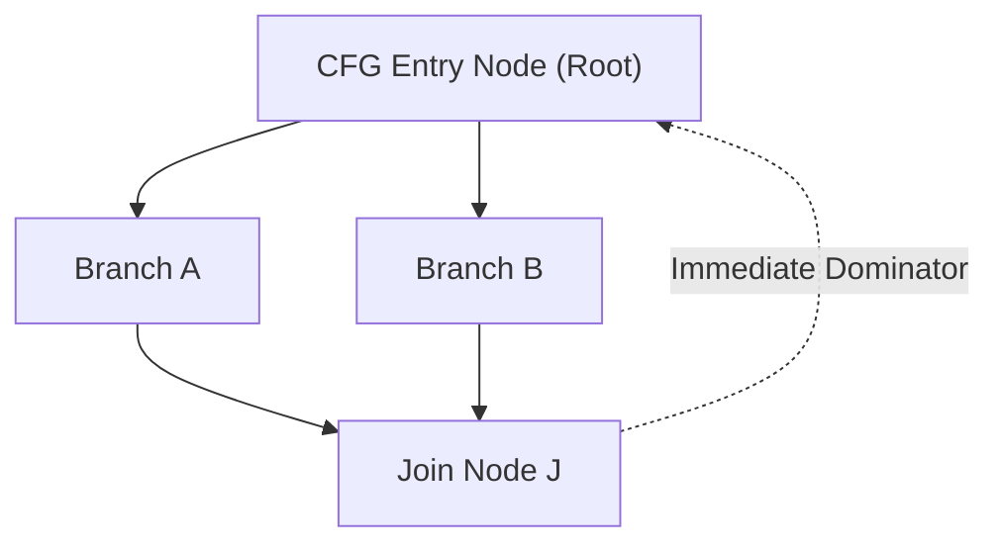

# Dominator Tree CFG Analysis Skill

High-efficiency, zero-dependency Python implementation of **Dominator Tree Construction and Immediate Dominator (idom) Analysis** for compiler optimization and SSA conversion.

## Features
- **Fixed-Point Dataflow Iteration**: Robust monotone framework solving semilattice dominator equations.
- **Immediate Dominator Identification**: Identifies unique closest strict dominators for SSA dominance frontiers.
- **Zero External Dependencies**: Pure Python standard library.
- **Native MCP Protocol**: JSON-RPC 2.0 stdio server compatible with Claude Desktop, Cursor, and Windsurf.

## Architecture

